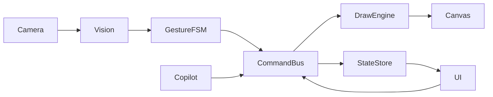

# Technical Design

## Architecture Overview
AirDraw follows a modular monorepo structure with shared TypeScript types. Packages include:
- **core**: vision, drawing algorithms, command bus
- **web**: React application with canvas, HUD, radial palette, copilot UI
- **wasm**: optional Rust/C++ filters compiled to WebAssembly
- **server**: optional Node API for cloud features
- **scripts**: build and tooling helpers



## Key APIs
### Hand Tracking Hook (web)
```ts
interface HandTrackerOptions { video: HTMLVideoElement }
function useHandTracking(opts: HandTrackerOptions): HandState
```
Returns smoothed keypoints and gesture events.

### Gesture State Machine (core)
```ts
interface GestureEvent { type: string; confidence: number }
class GestureFSM {
  on(event: GestureEvent): void
  getState(): string
}
```
Maps keypoint patterns to deterministic states.

### Command Bus (core)
```ts
interface Command { id: string; args: Record<string, any>; dryRun?: boolean }
class CommandBus {
  dispatch(cmd: Command): Promise<void>
  undo(): void
  redo(): void
}
```
Executes commands with undo support.

### Brush Pipeline (core)
```ts
interface BrushStroke { points: Vec2[]; brush: BrushConfig }
class BrushEngine {
  start(config: BrushConfig): void
  addPoint(p: Vec2): void
  end(): BrushStroke
}
```
Applies One‑Euro filter and Catmull‑Rom fitting before committing to canvas.

## Data Flow
1. Camera frames feed into MediaPipe Hands via WebAssembly.
2. Keypoints are smoothed by One‑Euro filter.
3. GestureFSM emits high‑level events (pinch, swipe, etc.).
4. Events map to CommandBus actions. UI and copilot also dispatch commands.
5. BrushEngine renders strokes on the active layer in a WebGL canvas.
6. CommandBus updates history stack for undo/redo.

## Trade‑offs
- **MediaPipe vs custom model**: MediaPipe offers mature WebAssembly build and good accuracy but increases bundle size (~2MB). Trade‑off accepted for MVP.
- **WebGL vs Canvas2D**: WebGL provides better compositing performance; fallback to Canvas2D for older browsers.
- **IndexedDB**: Robust for local persistence but complex schema. Chosen for offline-first requirement.

## Pseudocode Examples
### Gesture Engine
```ts
for frame in videoStream:
  kp = detectHand(frame)
  kp = oneEuroFilter(kp)
  gesture = fsm.update(kp)
  if gesture.changed:
    emit(gesture.state)
```

### Brush Pipeline
```ts
engine.start(config)
for pt in streamPoints():
  smoothed = oneEuro(pt)
  fitted = fitCatmull(smoothed)
  canvas.draw(fitted, config)
engine.end()
```
